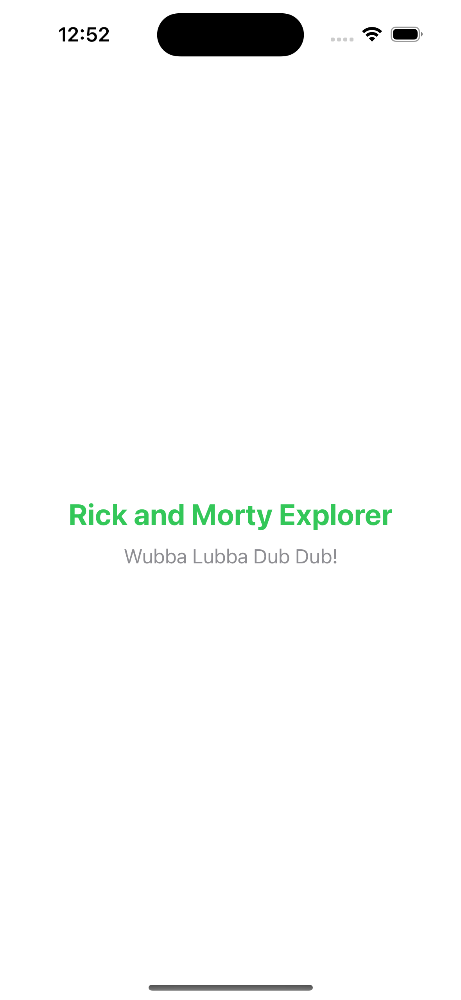
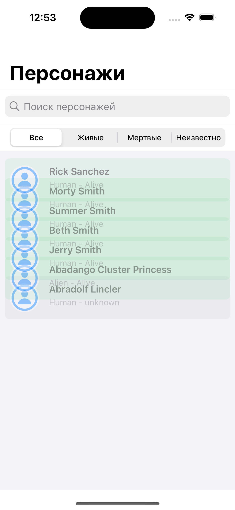
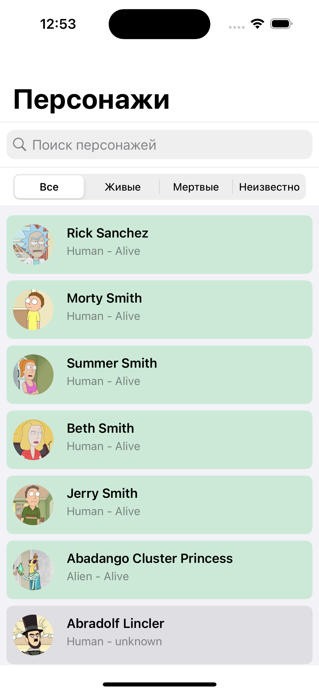
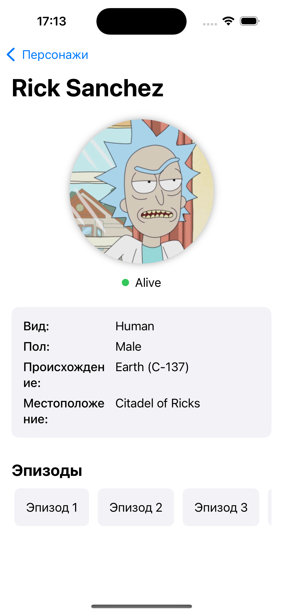
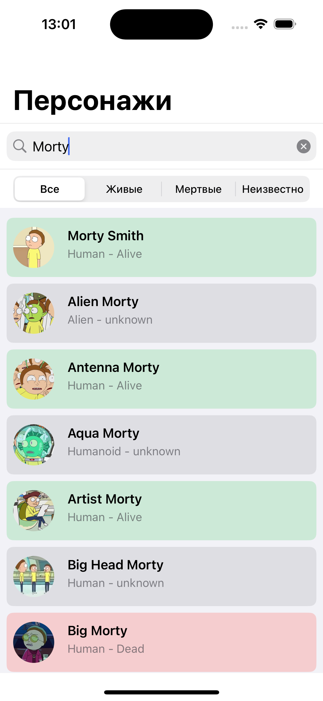
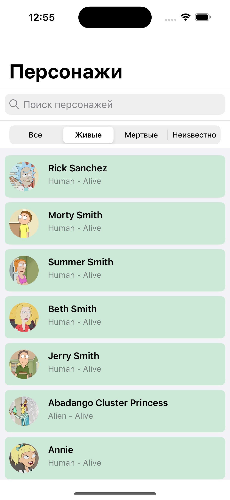
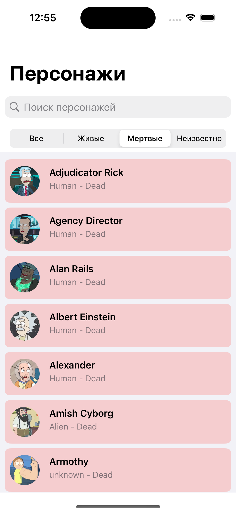
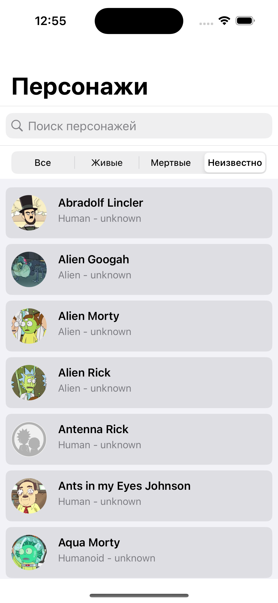

# Тестовое задание Rick and Morty Explorer

#### Описание:
Создать приложение, которое загружает и отображает персонажей из Rick and Morty API.

#### Основной функционал:
- Список персонажей: Таблица или коллекция с базовыми данными (имя, изображение, статус).
- Динамическая верстка: Отображение экрана с уникальным UI в зависимости от полученных данных (например, разные цветовые схемы в зависимости от статуса и т.п.).
- Детальный экран: При нажатии на персонажа — подробная информация с анимацией перехода.
- Поиск/Фильтрация: Возможность фильтровать персонажей по имени или статусу.

#### Требования к реализации:
- Верстка: Часть экрана на UIKit (например, список), часть — на SwiftUI (детальный экран или отдельный компонент).
- Архитектура: Базовый вариант — MVC; доп. задание — на MVVM с использованием Combine для связи модели и представления.
- Анимации: Кастомный переход

## Скриншоты

### Экран запуска

### Список персонажей

### Детальная информация о персонаже

### Анимации и переходы

### Поиск персонажей

### Фильтрация по статусу

## Техническая реализация

### Использованные технологии
- **UIKit** для списка персонажей и основной навигации
- **SwiftUI** для детального экрана персонажа
- **UIKit + SwiftUI интеграция** через UIHostingController
- **Архитектура MVC и MVVM** для разных экранов
- **Swift Concurrency** (async/await) для сетевых запросов
- **Кастомные анимации перехода** с использованием UIViewControllerAnimatedTransitioning
- **SDWebImage** для эффективной загрузки и кэширования изображений
- **Интерактивные жесты** для возврата с помощью UIPanGestureRecognizer

### Архитектурные решения
- **Чистая архитектура** с разделением на слои:
  - **Presentation Layer**: Views, ViewControllers, ViewModels с ясным разделением обязанностей
  - **Data Layer**: NetworkService, API-клиенты, DTO-модели
- **Независимые модели данных**:
  - DTO-модели для сетевых данных (`Character`, `CharacterResponse`)
  - Модели представления (`CharacterListItem`, `CharacterDetailItem`) без зависимостей от сетевого слоя
- **Трансформация данных**: Преобразование между DTO и моделями представления происходит в контроллерах/вьюмоделях через статические методы
- **Инверсия зависимостей**: Использование протоколов для ключевых сервисов (NetworkService, DataFetcher)
- **Компоненты UI**:
  - **CharacterListScene (MVC)**:
    - CharacterListView - отображение списка и фильтров
    - CharacterListViewController - управление данными и взаимодействие с API
    - CharacterListState - модель состояния экрана
  - **CharacterDetailScene (MVVM)**:
    - CharacterDetailView (SwiftUI) - отображение данных персонажа
    - CharacterDetailViewModel - подготовка данных для представления
    - CharacterDetailViewController - интеграция SwiftUI в UIKit
- **Фабрики** для создания модулей:
  - CharacterListSceneFactory
  - CharacterDetailFactory
  - AlertFactory
- **Роутеры** для навигации между экранами и управления переходами
